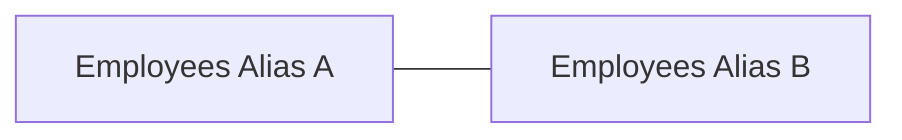

# From Zero to Hero

## Cheat Sheet

### Keywords for SQL: 
* `SELECT`
* `FROM`
* `WHERE`
* `AND` / `OR`
* `BETWEEN`
* `IN`
* `DISTINCT`
* `ORDER BY`
* `GROUP BY`
* `DESC`
* `LIMIT`
* `AS`
* `JOIN ON`
* `HAVING`
* `USING`
* `DEFAULT`

### Functions for SQL:
* `COUNT`
* `AVG`
* `SUM`
* `MIN` and `MAX`

### Numeric Operators:
* `=`, `>=`, `<=`, `!=`
* `>`, `<`
* `+`, `-`, `*`

### Logical Operators:
* `AND`, `OR`, `NOT`

### String Handling (Specific to Postgres)
* Use single qutoes around `'strings'`.
* Single quote is escaped by using two single quotes `''` in a row.

### Date handling for USA (Specific to Postgres)
* Use single quotes around date with format `'yyyy-mm-dd'`
* Can use +, -, >, <, =

## Database Queries
### `SELECT` all from a table
``` sql 
SELECT * 
FROM `TableName`;
```
### `SELECT` specific columns from a table
``` sql
SELECT `ColumnName1`, `ColumnName2` 
FROM `TableName`;
```
### `SELECT` `DISTINCT` (unique) values
``` sql
SELECT DISTINCT `ColumnName1` 
FROM `TableName`;
```
Unique value queries also work with multiple columns (unique combination of columns).
### `COUNT` selected results
 ``` sql
 SELECT COUNT(*) 
 FROM `TableName`;
 ```
 This can be combined with distinct.
 ``` sql
 SELECT COUNT(DISTINCT `ColumnName`) 
 FROM `TableName`;
 ```
### Combining selected fields
Columns can be operated on using supported operators by the specific implementaiton of SQL
``` sql
SELECT `ColumnName3`, `ColumnName1` - `ColumnName2` 
FROM `TableName`;
```
### Searching for specific text with `WHERE`
``` sql
SELECT `ColumnName1` 
FROM `TableName` 
WHERE `ColumnName2` = 'specific text';
```
### Searching numeric fields with `WHERE`
Getting a count for a specific id
``` sql
SELECT COUNT(*) 
FROM `TableName` \
WHERE `ColumnId`=3;
```
Finding a count of occurrences for an exceeded value
``` sql
SELECT COUNT(*) 
FROM `TableName` 
WHERE `ColumnName`>100;
```
### Searching date fields with `WHERE`
Pretty much the same as numeric fields e.g.
``` sql
SELECT COUNT(*) 
FROM `TableName` 
WHERE `ColumnDate`>'yyyy-mm-dd';
```
### Searching with logical operators
Combine queries such as text and numeric queries.  
You can use parentheses to create complex queries as well.
``` sql
SELECT COUNT(*) 
FROM `TableName` 
WHERE `ColumnName1`>100 AND 'ColumnName2'='specific text';
```
``` sql
SELECT COUNT(*) 
FROM `TableName` 
WHERE `ColumnName`='Condition1' OR 'ColumnName'='Condition2';
```
``` sql
SELECT COUNT(*) 
FROM `TableName` 
WHERE NOT `ColumnName`='Condition';
```
``` sql
SELECT COUNT(*) 
FROM `TableName` 
WHERE (`ColumnName`='Condition1' OR 'ColumnName'='Condition2') 
AND `ColumnName2` > 100;
```
### Searching with `BETWEEN`
`BETWEEN` is a shortcut for `>= AND <=`
``` sql
SELECT COUNT(*) 
FROM `TableName` 
WHERE `ColumnName` BETWEEN 10 AND 20;
```
### Searching with `IN`
`IN` is a shortcut for chaining `OR` statements
``` sql
SELECT COUNT(*) 
FROM `TableName` 
WHERE `ColumnName` IN ('Condition1', 'Condition2', 'Condition3');
```
### Sorting queries with `ORDER BY`
Sort ascending
``` sql
SELECT DISTINCT `ColumnName1` 
FROM `TableName`
ORDER BY 'ColumnName1';
```
Sort descending
``` sql
SELECT DISTINCT `ColumnName1` 
FROM `TableName`
ORDER BY 'ColumnName1' DESC;
```
Can sort sequentially (orders from left to right)
``` sql
SELECT DISTINCT `ColumnName1`, `ColumnName2` 
FROM `TableName`
ORDER BY 'ColumnName2' ASC, `ColumnName1` DESC;
```
Can use `NULLS FIRST` for queries that might have a null in the column, it will put NULL at the top. Good for `GROUP BY GROUPING SETS` type queries that might group something by `SUM`
### Searching with `MIN` and `MAX`
Can search for minimums on types that support logical operations
``` sql
SELECT MIN(`ColumnName`) 
FROM `TableName`
WHERE `ColumnName2`=`specific text`;
```
Also supports column arithmetic in function calls
### Searching with `AVG` and `SUM`
Can search for averages and sums with types that support the logical operations
``` sql
SELECT AVG(`ColumnName`) 
FROM `TableName`
WHERE `ColumnName2`=`specific text`;
```
### Using `LIKE` to match patterns
`%` Stands for zero, one, or more characters
* `a%` -- all column values that start with "a"
* `%e` -- all column values that end with "e"
* `%bob%` -- all column values with "bob" in the text
*  `a%e` -- all column values that start with "a" and end
with "e"
``` sql
SELECT `ColumnName1`, `ColumnName2` 
FROM `TableName`
WHERE `ColumnName2` LIKE `a%`;
```
`_` Stands for any single character
* `_a%` -- has "a" as the second letter
* `a_%_%` -- starts with "a" and has at least 2 other letters
### Using `AS` to rename a column in a query (Aliases)
Good for improving readability of returned queries.  
Postgres supports `AS` in `ORDER BY` and `GROUP BY`
``` sql
SELECT `ColumnName1` * `ColumnName2` as `AliasName`
FROM `TableName`;
```
### Using `LIMIT` to reduce results
``` sql
SELECT `ColumnName`
FROM `TableName`
LIMIT `number`;
```
### NULL Values
It is a special value that represents an unknown. It can be queried using the `WHERE` keyword
``` sql
SELECT `ColumnName`
FROM `TableName`
WHERE `ColumnName` IS NULL 
```
Can also use `NOT NULL`
## Schemas
### Querying DBs with lots of schemas
Querying a database that makes use of schemas needs to include the schema as part of the query.  
``` sql 
SELECT * 
FROM `SchemaName`.`TableName`;
```
Databases that don't use schemas typically have their table paths pointed to the `public` schema and therefore don't need to include the schema name.
## Getting Data From Many Tables
### `INNER JOIN`s
* Pulls back records that have an `id` in both records
* Use the full name syntax when field names are in both tables
```sql
SELECT `ColumnNames`
FROM `TableName1`
INNER JOIN `TableName2` ON `TableName1.ColumnName1` = `TableName2.ColumnName2`;
```
* Can just use `JOIN` because the default is `INNER JOIN`
* Joins can be stacked beyond just two tables.
* If there are ambiguous fields, you can specify which table the ambiguous field should belong to i.e. `SELECT Column1, Table2.Column2`
### `LEFT JOIN`s
* Pulls back all records in first table and any matching data in the second table.
* This essentially means that if there are no records in the second table, then the joined columns for the second table will show up as NULL
```sql
SELECT `ColumnNames`
FROM `TableName1`
LEFT JOIN `TableName2` ON `TableName1.ColumnName` = `TableName2.ColumnName`
```
### `RIGHT JOIN`s
* Pulls back matching records in the first table and all records in second table.
* Same syntax as `LEFT JOIN`, just use `RIGHT JOIN` instead
### `FULL JOIN`s
* Pulls all records in first table and all records in second table
* Same syntax but with `FULL JOIN`
* Can help identify orphan records
### Self `JOIN`s
* Connect a table back to itself
* The two main cases are
  * Some kind of heirarchy data such as employees that report to other employees
  * Similarities or dissimilarities such as everyone in the same city, or everyone w/ the same birthday
* `Aliases` are needed to rename tables so we can differentiate which version of table we are referring to.


```sql
SELECT `ColumnNames`
FROM `TableName` AS `Alias1`
JOIN `TableName` AS `Alias2` ON `Alias1.ColumnName`=`Alias2.ColumnName`
WHERE `Condition`
```
* Condition sometimes is `Alias1.ColumnName <> Alias2.ColumnName` to prevent some duplicates, but need subquery to fully remove duplicates.
### `USING` to shortcut `JOIN` syntax
* An example of this is replacing something like `ON TableName.ColumnName=TableName2.ColumnName` with `USING(ColumnName)`
### `NATURAL` Shorthand
* `NATURAL` is shorthand for `USING` with a list of all columns that are the same in both tables.
```sql
FROM `TableName`
NATURAL JOIN `TableName2`
```
* `NATURAL` can be used to `JOIN` multiple tables together, but it must connect previous table to the next table or it will do a cross join connecting every row to every other row
* It will match all the fields that have the same name, which usually are ID fields. 
### `GROUP BY ` aggregations
```sql
SELECT `ColumnName`, AGGREGATION_FUNCTION
FROM 'TableName'
WHERE `Condition`
GROUP BY 'ColumnNames'
ORDER BY 'ColumnNames'
```
* The query will return the results of the aggregation based on the aggregation function and the `GROUP BY` column
* Can `SELECT` and `ORDER BY` the aggregation function e.g. `COUNT(*)`, `AVG(ColumnName)`
### `HAVING ` to filter `GROUP BY` aggregations
```sql
SELECT `ColumnNames`
FROM 'TableName'
WHERE 'Condition'
GROUP BY 'ColumnNames'
HAVING 'Condition'
ORDER BY 'ColumnNames'
```
* After the aggregation, you can filter with `HAVING` and 
* `HAVING` similar to `WHERE`, but `HAVING` filters after the `GROUP BY` has occurred
### Grouping Sets
* Any Group of Columns you are using in `GROUP BY` phrase.
* Could run multiple queries, each one grouping over different set of columns or even `UNION` them together.
  * This requires multiple passes through the data, so its slower
  * Also, more code to write and not as clear
* Solution is to use `GOUP By GROUPING SETS((FIELD1), (FIELD2), (FIELD3,FIELD4))`
* Can use `ORDER BY` and `NULLS FIRST` to help bubble up totals in certain groupings or categories.
```sql
SELECT 'ColumnNames', SUM('ColumnNames')
FROM 'TableName'
GROUP BY GROUPING SETS ('ColumnName', ('ColumnName', 'ColumnName'))
ORDER BY 'ColumnNames' NULLS FIRST
```
### `ROLLUP` as a shorthand for `GROUPING SETS`
* It is shorthand for grouping sets 
* So `ROLLUP(E1,E2,E3)` would be the same as `GROUPING SETS((E1,E2,E3...), ... (E1,E2), (E1), ())`
```sql
SELECT 'ColumnNames', SUM('ColumnNames')
FROM 'TableName'
GROUP BY ROLLUP ('ColumnName', 'ColumnName', 'ColumnName')
```
### `CUBE` for subsets
* `CUBE(a,b,c)` would be the same as `GROUPING SETS((a,b,c), (a,b), (a,c), (a), (b,c), (b), (c), ())`
### `UNION` for combining results
* Combines the results of 2 or more queries
* Must have the same number of columns, column types must line up (be the same)
* Removes duplicates
  * Use `UNION ALL` to not remove duplicates
```sql
SELECT 'ColumnNames'
FROM 'TableName'

UNION

SELECT 'ColumnNames'
FROM 'TableName'
```
### `INTERSECT` for combining results
* Combines queries to bring back items in both sets
* Must have the same number of columns and column types must line up.
* Removes duplicates
* `INTERSECT ALL` to include duplicates

```sql
SELECT 'ColumnNames'
FROM 'TableName'

INTERSECT

SELECT 'ColumnNames'
FROM 'TableName'
```
### `EXCEPT` for combining results
* Puts items in the first query, but not the second one.
* Must have same number of columns, types must line up
* Removes duplicates
* `EXCEPT ALL` to include duplicates

```sql
SELECT 'ColumnNames'
FROM 'TableName'

EXCEPT

SELECT 'ColumnNames'
FROM 'TableName'
```
## Subqueries
### `SELECT` with `EXISTS` subquery
* A way to filter data with a subquery where a condition within the `EXISTS` function is true.
* Can invert the result with `NOT EXISTS`
* The `WHERE` clause needs to join the outer table with the table being used in the subquery
* Can have `JOIN` in subquery

```sql
SELECT 'ColumnNames'
FROM 'TableName'
WHERE EXISTS(SELECT 'ColumnName' FROM 'TableName' WHERE 'Condition')
```
### `SELECT` with `ANY` and `ALL` syntax

* Takes rows from which any of the returned subqueries matches the conditions.
* Comparison operators include `=`, `>=`, `<=`, `!=`, `<`, `>`

```sql
SELECT 'ColumnNames'
FROM 'TableName'
WHERE 'ColumnName' 'ComparisonOperator' ANY (SELECT 'ColumnName' FROM 'TableName' WHERE 'Condition')
```


## Database Design

### Typical naming scheme
Typically, tables are the plural of the noun being stored.
* Customer data => Customers
* Order data => Orders
There is usually an id field that is singular of noun with ID added to the end
* Customers => CustomerId
* Orders => OrderId
* Used [Mermaid](https://mermaid-js.github.io/mermaid/#/)
### Diagramming Table Relationships
```Mermaid
erDiagram
    customers {
        int customerid
        string companyname
        string contactname
        string contacttitle
        string address
        string city
        int postalcode
        string country
        string region
        string fax
        string phone

    }
    
    orders }|--|| customers : has
    orders }|--|| employees : has
    orders {
        int orderid
        int customerid
        int employeeid
        date orderdate
        date requireddate
        date shippeddate
        string shipvia
        string freight
        string shipname
        string shipaddress
        string shipcity
        string shipregion
        string shippostalcode
        string shipcountry
    }

    categories {
        int categoryid
        string categoryname
        string description
        blob picture
    }

    customercustomerdemo }|--|| customers : has
    customercustomerdemo }|--|| customerdemographics : has
    customercustomerdemo {
        int customerid
        int customertypeid
    }

    customerdemographics {
        int customertypeid
        string customerdesc
    }

    employees {
        int employeeid
        string lastname
        string firstname
        string title
        string titleofcourtesy
        date birthdate
        date hiredate
        string address
        string city
        string region
        string postalcode
        string country
        string homephone
        string extension
        blob photo
        string notes
        string reportsto
        string photopath
    }

    employeeterritories }|--}| employees : has
    employeeterritories }|--}| territories : has
    employeeterritories {
        int employeeid
        int territoryid
    }
    
    order_details }|--|| orders : has
    order_details }|--|| products : has
    order_details {
        int orderid
        int productid
        float unitprice
        int quantity
        float discount
    }

    products }|--|| suppliers : has
    products }|--|| categories : has
    products {
        int productid
        string productname
        int supplierid
        int categoryid
        int quantityperunit
        float unitprice
        bool unitisinstock
        int unitsonorder
        int reorderlevel
        bool discontinued
    }

    region {
        int regionid
        string regiondescription
    }

    shippers {
        int shipperid
        string companyname
        string phone
    }

    suppliers {
        int supplierid
        string companyname
        string contactname
        string contacttitle
        string address
        string city
        string region
        string postalcode
        string country
        string phone
        string fax
        string homepage
    }

    territories }|--|| region : has
    territories {
        int territoryid
        string territorydescription
        int regionid
    }

    usstates {
        int statied
        string statename
        string stateabbr
        string stateregion
    }
```

## Using psql CLI (Postgres specific)
### Connecting to the database
Connection information can be found in pgAdmin by clicking on the PostGreSQL Icon and going to the `Properties` tab.
```terminal
psql --port=5432 --host=localhost --dbname=northwind --username=postgres
```
OR
```terminal
psql -p 5432 --h localhost -d northwind -U postgres
```
* Connection parameters can be set into bash profile or environment variables by defining  `PGHOST`, `PGPORT`, `PGUSER`, `PGDATABASE`
* A .pgpass file can be placed in the home directory that contains a string formatted as `hostname:port:daatabase:username:password`
* .pg_service.conf file can be created to support multiple databases
```conf
[myservice]
host=
port=
dbname=
user=
password=
```
Then command can be written as:
```terminal
psql service=myservice
```
### Common Commands
* Use `space` to scroll through query entries
* Use `Q` to quit out of scrolling
* Use `\l` to list database
* Use `\! command` (Bang lets you use system commands)
* Use `\c dbname` to connect to a database
* Use `\dn` to view all the schemas
* Use `\dt schemaName.` to view all schema's table. Note the "."
* Make sure to follow SQL statements with ";" or the command will hang.
